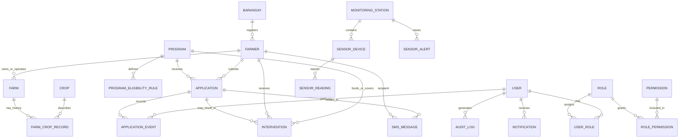

# MAGRO Database Design

**Project:** MAGRO — Municipal Agriculture Management and Decision Support System  
**Status:** Draft for review — not approved for implementation  
**Stack assumption:** PostgreSQL + PostGIS, accessed through a Laravel backend  
**Purpose:** Define the proposed data model before application code is written.

> This is a logical design, not a final migration script. Confirm the open decisions at the end before treating this as an implementation contract. Do not store real farmer information in development or test data.

## 1. Design principles

1. Use a stable internal ID for every main record. Keep external identifiers such as RSBSA numbers as separate fields.
2. Preserve history. Do not overwrite old crop seasons, assistance, transaction decisions, sensor readings, or SMS outcomes when a new event occurs.
3. Keep access control and sensitive-data protections in the backend, not only in the user interface.
4. Store dates and timestamps consistently. Store event timestamps in UTC and display them in the user's configured local time zone.
5. Use database constraints for essential integrity rules, and Laravel validation for understandable user-facing errors.
6. Use PostGIS for spatial data. Apply permissions to map APIs and exports so restricted coordinates are not exposed to unauthorized roles.
7. Record important changes in an append-oriented audit log. Restrict audit-log editing and deletion.
8. Treat sensor values as observations and advisories. The system must not automatically operate irrigation equipment.
9. Keep hosting, SMS provider, and hardware message transport details configurable; do not bake a provider into the data model.
10. Avoid hard deletion of operational records where it would break history or auditability. Use archival or soft deletion only where the retention policy permits it.

## 2. Relationship overview

The diagram is a conceptual starting point. A final physical schema may split or add tables after the open decisions are settled.

## 3. Proposed entities

Suggested primary keys use UUIDs for operational records unless a stable sequential key is required for a specific integration. A readable farmer system ID should be generated separately and must not be the database primary key.

### 3.1 Identity, access, and audit

#### `users`
Staff accounts only; farmers are beneficiaries and SMS recipients, not administrative login users.

- `id` — primary key
- `name`
- `username` or `email` — unique login identifier, final choice pending
- `password_hash`
- `is_active`
- `last_login_at` — nullable
- `created_at`, `updated_at`

Do not store plaintext passwords. Use Laravel's supported password hashing and authentication mechanisms.

#### `roles`
- `id` — primary key
- `name` — unique, e.g. Administrator, Municipal Agriculturist, Encoder
- `description`
- `is_system_role`
- timestamps

#### `permissions`
- `id` — primary key
- `key` — unique machine-readable permission key
- `description`
- timestamps

#### `user_roles`
- `user_id` — FK to `users`
- `role_id` — FK to `roles`
- optional `assigned_by_user_id` — FK to `users`
- `assigned_at`
- unique constraint on (`user_id`, `role_id`)

#### `role_permissions`
- `role_id` — FK to `roles`
- `permission_id` — FK to `permissions`
- unique constraint on (`role_id`, `permission_id`)

Permission keys should be action-oriented and scoped where necessary, for example `farmers.view`, `farmers.create`, `applications.approve`, `reports.export`, `devices.manage`, `users.manage`, and `audit.view`. Final permissions must be agreed before implementation.

#### `audit_logs`
- `id` — primary key
- `actor_user_id` — nullable FK to `users` for system-generated events
- `action`
- `entity_type`
- `entity_id` — identifier of the affected record; polymorphic reference, not a conventional FK
- `occurred_at`
- `ip_address` — subject to privacy and retention policy
- `request_id` — nullable correlation identifier
- `before_data` / `after_data` — JSONB, with sensitive values excluded or redacted
- `reason` — nullable, especially for sensitive changes

Log authentication and authorization events, record creation/updates, approvals/rejections/returns, imports, exports, configuration changes, restore operations, and changes to user roles. Define a retention policy. Avoid logging passwords, session secrets, full SMS credentials, or unnecessary personal data.

### 3.2 Farmer, farm, and crop records

#### `barangays`
- `id` — primary key
- `name`
- `code` — nullable until the official code source is confirmed
- `boundary_geom` — nullable PostGIS `MultiPolygon` in the agreed spatial reference system
- `is_active`
- timestamps

Add a spatial index for `boundary_geom`. Confirm the official barangay boundary source, coordinate reference system, and update process before loading authoritative boundaries.

#### `farmers`
- `id` — primary key
- `system_id` — unique, permanent human-readable MAGRO farmer ID
- `rsbsa_number` — nullable or required only after policy confirmation; indexed and normalized for comparison
- `first_name`, `middle_name` — nullable where appropriate, `last_name`, `suffix`
- `birth_date` — nullable if not required
- `sex` — only if required by approved forms/reporting
- `phone_number` — nullable, normalized format to be decided
- `address_text`
- `barangay_id` — FK to `barangays`
- `status` — active, inactive, archived, or other approved values
- `created_by_user_id`, `updated_by_user_id` — FKs to `users`
- timestamps and optional `deleted_at` only if the retention policy permits soft deletion

Keep `system_id` stable even if the farmer's name, address, phone, or RSBSA details change. Do not assume RSBSA alone is a universally unique key without confirming local data rules. Use duplicate-warning logic based on normalized RSBSA and other approved matching signals; allow an authorized review rather than silently merging people.

#### `farms`
- `id` — primary key
- `farmer_id` — FK to `farmers`
- `farm_name` — nullable
- `barangay_id` — FK to `barangays`
- `area_value`
- `area_unit` — controlled values such as hectares or square metres
- `location_geom` — optional PostGIS point
- `boundary_geom` — optional PostGIS polygon/multipolygon
- `location_precision` — optional indicator if exact coordinates are withheld or approximate
- `status`
- `created_by_user_id`, `updated_by_user_id`
- timestamps

A farmer may have multiple farms. Confirm whether one farm can have multiple co-owners/operators; if so, add a `farm_participants` association table rather than storing only one `farmer_id`.

#### `crops`
- `id` — primary key
- `name` — unique or unique within an agreed crop classification
- `crop_code` — nullable
- `is_active`
- timestamps

#### `farm_crop_records`
A historical record of a crop on a farm, rather than a single mutable crop field on `farms`.

- `id` — primary key
- `farm_id` — FK to `farms`
- `crop_id` — FK to `crops`
- `season_name` or `season_id` — final representation pending
- `planted_at` — nullable
- `harvested_at` — nullable
- `area_value`, `area_unit` — nullable if farm-level area is enough
- `notes` — nullable
- `recorded_by_user_id` — FK to `users`
- timestamps

Validate that end dates do not precede start dates. Confirm whether the system needs a separate crop-season calendar and whether multiple crops can be recorded for the same farm and season.

### 3.3 Programs, eligibility, applications, and assistance

#### `programs`
- `id` — primary key
- `name`
- `program_code` — nullable, unique if used
- `description`
- `start_date`, `end_date` — nullable
- `status` — draft, active, closed, archived, or approved set
- `created_by_user_id`, `updated_by_user_id`
- timestamps

#### `program_eligibility_rules`
Store versioned, reviewable rule definitions rather than hard-coding every program's conditions in the interface.

- `id` — primary key
- `program_id` — FK to `programs`
- `version`
- `name`
- `rule_definition` — JSONB using a documented, validated rule format
- `effective_from`, `effective_to` — nullable
- `is_active`
- `created_by_user_id`
- `approved_by_user_id` — nullable until workflow is defined
- timestamps

The rule format must be restricted to supported fields/operators; do not execute arbitrary code from JSON. Record which rule version was used when eligibility was evaluated so a later rule edit does not rewrite the explanation for an old decision.

#### `applications`
Represents a request or transaction for a program.

- `id` — primary key
- `application_number` — unique human-readable reference
- `farmer_id` — FK to `farmers`
- `program_id` — FK to `programs`
- `farm_id` — nullable FK to `farms` when the request is farm-specific
- `status` — controlled workflow states, proposed: draft, submitted, under_review, returned, approved, rejected, fulfilled, cancelled
- `submitted_at` — nullable
- `current_assignee_user_id` — nullable FK to `users`
- `eligibility_result` — nullable structured result
- `eligibility_rule_version_id` — nullable FK to `program_eligibility_rules`
- `created_by_user_id`, `updated_by_user_id`
- timestamps

Add workflow validation in the backend and database constraints where practical. Do not permit a user to approve their own application if that user created or submitted it, according to the agreed definition of self-approval. Prevent invalid status jumps. The exact state machine must be confirmed.

#### `application_events`
Append-only history of workflow changes.

- `id` — primary key
- `application_id` — FK to `applications`
- `actor_user_id` — nullable FK to `users` for system events
- `event_type` — submitted, assigned, returned, approved, rejected, resubmitted, fulfilled, cancelled, etc.
- `from_status`, `to_status`
- `reason` — required for return/rejection when policy says so
- `notes` — nullable
- `occurred_at`
- `metadata` — JSONB with a documented schema, no secrets

A decision should be represented in this event history, not only as an overwritten status field.

#### `interventions`
Records assistance actually delivered or an approved intervention event, based on the final business definition.

- `id` — primary key
- `farmer_id` — FK to `farmers`
- `farm_id` — nullable FK to `farms`
- `program_id` — FK to `programs`
- `application_id` — nullable FK to `applications`
- `intervention_type`
- `description`
- `quantity` / `quantity_unit` — nullable
- `approved_at`, `delivered_at` — nullable until applicable
- `recorded_by_user_id` — FK to `users`
- `status` — controlled values
- timestamps

Do not treat application approval as proof that assistance was delivered. Preserve separate approval and delivery facts. Store each assistance event as a separate record so previous assistance can be checked. Gap calculations should use applicable configured rules and must not flag a gap where no applicable rule exists.

#### `intervention_gap_rules`
- `id` — primary key
- `program_id` or `intervention_type` scope — exact scope to be finalized
- `minimum_gap_value`
- `gap_unit` — days, months, or another explicitly supported unit
- `effective_from`, `effective_to`
- `is_active`
- timestamps

This table is optional until the municipal office confirms how gap rules are scoped and measured. Do not infer a universal gap rule.

### 3.4 IoT monitoring, readings, and alerts

#### `monitoring_stations`
Represents the three selected soil-monitoring locations and any water-level monitoring sites. The model should not hard-code a maximum of three rows.

- `id` — primary key
- `name`
- `station_type` — soil_moisture, water_level, or multi_sensor
- `barangay_id` — nullable FK to `barangays`
- `location_geom` — PostGIS point
- `is_active`
- `installation_notes` — nullable
- timestamps

#### `sensor_devices`
- `id` — primary key
- `station_id` — FK to `monitoring_stations`
- `device_identifier` — unique identifier supplied by the device
- `device_type`
- `manufacturer` / `model` — nullable
- `firmware_version` — nullable
- `installed_at`, `last_seen_at` — nullable
- `status` — active, inactive, maintenance, retired, or approved values
- `configuration` — JSONB for non-secret, validated configuration
- timestamps

Do not store SIM PINs, API secrets, or other credentials in plain text in `configuration`.

#### `sensor_readings`
Time-series observations from a device.

- `id` — primary key
- `device_id` — FK to `sensor_devices`
- `observed_at` — timestamp reported by device
- `received_at` — server receipt timestamp
- `metric` — e.g. soil_moisture or water_level
- `value`
- `unit`
- `quality_status` — valid, suspect, invalid, or approved controlled values
- `raw_payload` — nullable JSONB after excluding secrets and unnecessary data
- `ingestion_id` — nullable idempotency/deduplication key

Index by (`device_id`, `observed_at`) and consider time partitioning only if observed volume warrants it. Reject or quarantine malformed readings; retain enough diagnostic metadata to investigate ingestion errors. Confirm sensor units, calibration procedure, sampling rate, retention, and deduplication key before implementation.

#### `sensor_threshold_configs`
- `id` — primary key
- `station_id` or `device_id` scope — final choice pending
- `metric`
- `threshold_definition` — validated structured definition
- `effective_from`, `effective_to`
- `is_active`
- `created_by_user_id`
- timestamps

Thresholds must be configurable and tied to the relevant sensor metric. A soil-moisture threshold is an advisory, not an irrigation command. Water-level thresholds support flood-risk monitoring. Threshold values and interpretation require domain approval and sensor calibration.

#### `sensor_alerts`
- `id` — primary key
- `station_id` — FK to `monitoring_stations`
- `device_id` — nullable FK to `sensor_devices`
- `reading_id` — nullable FK to `sensor_readings`
- `alert_type`
- `severity`
- `status` — new, under_review, confirmed, dismissed, resolved, or approved states
- `raised_at`
- `reviewed_by_user_id` — nullable FK to `users`
- `reviewed_at` — nullable
- `review_notes` — nullable
- `threshold_config_id` — nullable FK to `sensor_threshold_configs`
- timestamps

Generate an internal alert for authorized review. Do not send a farmer-facing SMS solely because an unreviewed raw reading crossed a threshold. Keep alert generation, human review, and SMS dispatch as distinct events.

### 3.5 SMS and notifications

#### `sms_messages`
Use a single outbound/inbound message ledger with direction and provider metadata, or split it into inbound/outbound tables if required by the chosen provider. The logical fields below apply either way.

- `id` — primary key
- `direction` — inbound or outbound
- `farmer_id` — nullable FK to `farmers` when matched
- `application_id` — nullable FK to `applications`
- `phone_number_snapshot` — destination/source number as observed for this message, with restricted access
- `message_text` — protected according to privacy policy
- `template_key` — nullable
- `provider_message_id` — nullable, unique within provider where applicable
- `provider_status`
- `status` — queued, sent, delivered, failed, received, processed, or other mapped states
- `related_alert_id` — nullable FK to `sensor_alerts`
- `created_by_user_id` — nullable FK to `users`
- `sent_at`, `delivered_at`, `received_at` — nullable
- `failure_reason` — nullable and sanitized
- timestamps

Store enough provider metadata to diagnose delivery, but do not couple the schema to a single SMS vendor. Define message retention, access, consent/notice, opt-out handling, retry behavior, and cost controls before enabling bulk sends.

#### `sms_templates`
- `id` — primary key
- `template_key` — unique
- `name`
- `body_template`
- `purpose`
- `is_active`
- `created_by_user_id`, `updated_by_user_id`
- timestamps

Template variables must be allowlisted and validated. Preview recipient count and message content before bulk sending.

#### `sms_replies` or inbound message handling
Inbound messages may be stored in `sms_messages` and parsed into a separate reply/action table if business rules require it. Replies such as `CONFIRM`, `DECLINE`, and `UNABLE` must be matched to a farmer and, where applicable, a specific message/application using explicit rules. Ambiguous replies should be queued for human review; do not silently change a transaction based on an uncertain match.

#### `notifications`
- `id` — primary key
- `user_id` — FK to `users`
- `type`
- `title`
- `body`
- `related_entity_type`, `related_entity_id` — nullable polymorphic reference
- `read_at` — nullable
- timestamps

Notifications are for system users unless the project later approves a separate farmer-facing account/channel model.

### 3.6 GIS layers and documents

#### `gis_layers`
- `id` — primary key
- `name`
- `layer_type` — barangay_boundary, farm, monitoring_station, intervention_coverage, flood_risk, or other approved types
- `source_name` — nullable
- `source_date` — nullable
- `uploaded_by_user_id` — FK to `users`
- `visibility_permission_key` — nullable FK-like reference to the relevant permission key
- `is_active`
- `metadata` — JSONB for non-sensitive import metadata
- timestamps

Depending on the source format, imported spatial features may be normalized into domain tables or held in a separate `gis_features` table with a PostGIS geometry column and validated attributes. Decide the approach based on expected file types and reporting requirements.

For Shapefile, KML, and KMZ imports, validate file size, geometry type, coordinate reference system, feature count, and attributes. Reject malformed or unexpected content and log who imported it. Do not trust uploaded file contents.

#### `documents`
- `id` — primary key
- `owner_entity_type`, `owner_entity_id` — approved polymorphic owner reference
- `original_filename`
- `storage_key` — internal storage path/key, not a public URL
- `mime_type`
- `file_size_bytes`
- `checksum`
- `uploaded_by_user_id` — FK to `users`
- `access_classification`
- timestamps

Store files outside the public web root or in private object storage. Use authorized download routes, validate file types and size, and define retention and malware-scanning policy.

### 3.7 Reports, imports, and backups

#### `saved_report_configs`
- `id` — primary key
- `name`
- `report_type`
- `configuration` — validated JSONB for filters, columns, grouping, and date range defaults
- `created_by_user_id` — FK to `users`
- `visibility` — private or shared, according to permissions
- timestamps

Never accept arbitrary SQL from a saved report configuration.

#### `import_jobs`
- `id` — primary key
- `import_type`
- `source_filename`
- `status` — uploaded, validating, previewed, processing, completed, failed, or approved values
- `created_by_user_id` — FK to `users`
- `row_count`, `success_count`, `failure_count`
- `validation_summary` — JSONB
- `started_at`, `finished_at` — nullable
- timestamps

Keep row-level errors in a related `import_errors` table if users need to download a detailed error report. Imports should support a preview and validation step before committing records. Define duplicate handling and rollback behavior.

Backup and restore metadata should only be stored if operationally useful; actual backup files must be encrypted and stored separately from the primary database. Backup/restore actions must be audited and restricted. Confirm who may initiate and approve a restore.

## 4. Data integrity and indexes

Proposed constraints and indexes, to confirm against actual query patterns:

- Unique index on `farmers.system_id`.
- Index normalized `farmers.rsbsa_number`; enforce uniqueness only if the municipality confirms that policy and data quality supports it.
- Index `farmers.barangay_id`, `farms.farmer_id`, `farms.barangay_id`, `applications.farmer_id`, `applications.program_id`, `applications.status`, and `interventions.farmer_id` / `program_id` / `delivered_at`.
- Index `application_events.application_id, occurred_at`.
- Index `sensor_readings.device_id, observed_at`, `sensor_readings.metric, observed_at`, and `sensor_alerts.status, raised_at`.
- Unique index on `sensor_devices.device_identifier`.
- Unique or provider-scoped unique index on `sms_messages.provider_message_id` when supported by provider semantics.
- Spatial GiST indexes for PostGIS geometry columns used in map queries.
- Add foreign keys with deliberate delete behavior. Prefer `RESTRICT` for historical/financial/assistance records; use `CASCADE` only for dependent rows whose deletion is explicitly safe.
- Use check constraints for nonnegative area/quantity where appropriate, valid date ranges, and enumerated status values where practical.
- Normalize phone numbers and RSBSA values for matching, while preserving original display values only when there is a justified need.

## 5. Analytics definitions

### Program coverage

Coverage must compare the same program, reporting period, and geographic scope:

`coverage_rate = unique farmers served during the period / eligible or target farmers for that same scope × 100`

The office must choose whether the denominator is eligible farmers or an official target count. Do not mix denominators or count multiple interventions to the same farmer as multiple unique farmers served. Define how “served” is established (for example, a recorded delivery date) before implementation.

### ICDI

`ICDI = municipal coverage rate − benchmark coverage rate`

- Positive: municipal coverage is above the benchmark.
- Zero: municipal coverage equals the benchmark.
- Negative: municipal coverage is below the benchmark.

Confirm the official ICDI expansion, benchmark source, time period, geographic comparison level, and treatment of missing/zero denominators. Do not calculate or label an ICDI result until its approved definition and benchmark data are available.

## 6. Privacy, security, and retention notes

- Use least-privilege role and permission checks in Laravel for every API endpoint and export.
- Apply field-level or endpoint-level restrictions to precise farm/farmer coordinates, phone numbers, and message content.
- Do not expose database IDs, private storage keys, sensor credentials, or provider secrets unnecessarily.
- Audit sensitive reads/exports where required by the municipality's policy.
- Define retention, correction, archival, and deletion rules for farmer records, SMS content, sensor readings, documents, and audit logs.
- Use encrypted connections and protected secrets; never commit credentials to Git.
- Use synthetic test records only, with fake names, phone numbers, RSBSA values, and coordinates.
- Backups need access controls, encryption, integrity checks, and tested restore procedures. A backup is not verified until a restore test succeeds.

## 7. Decisions required before implementation

Do not silently decide these points. Record the chosen answer in the architecture/requirements documents:

1. **Farmer ID:** required format, generation method, and whether it must be human-readable.
2. **RSBSA:** whether it is required, normalization rules, and whether duplicates are ever allowed.
3. **Farmer/farm ownership:** whether farms can have multiple owners or operators.
4. **Crop history:** whether seasons are a separate managed entity and whether planted/harvested dates and crop area are mandatory.
5. **Application workflow:** exact statuses, allowed transitions, meaning of returned versus rejected, who can approve, and the definition of self-approval.
6. **Eligibility:** supported rule fields/operators, who may edit/approve rules, and how historical rule versions are retained.
7. **Intervention definition:** whether an intervention means approved, scheduled, delivered, or any of these as separate event types.
8. **Assistance gap rules:** rule scope, duration units, effective dates, and what counts as a previous assistance event.
9. **IoT:** supported sensor metrics and units, calibration procedure, sampling interval, retention, device identity, authentication, and duplicate-reading strategy.
10. **Alerts:** threshold owners, severity levels, human-review roles, escalation, and what action can trigger an SMS.
11. **SMS:** provider and hardware integration, sender identity, consent/notice and opt-out policy, retry rules, reply matching, costs, and message retention.
12. **GIS:** authoritative barangay boundaries, coordinate reference system, import/export requirements, location precision, and who may see precise coordinates.
13. **Coverage:** whether denominator means eligible farmers or target farmers, the meaning of “served,” and reporting period boundaries.
14. **ICDI:** official definition, benchmark source, comparison scope, and handling of unavailable data.
15. **Documents:** allowed file types, size limits, retention, malware scanning, and access rules.
16. **Users and permissions:** final roles, permission matrix, and whether a user can hold multiple roles.
17. **Audit and privacy:** retention periods, sensitive fields to redact, and which reads/exports require audit events.
18. **Backups:** backup frequency, retention, encryption, storage location, and who can initiate/approve restoration.

## 8. Review checklist

Before marking this design approved:

- [ ] Requirements and architecture documents match this data model.
- [ ] Farmer/farm/crop history is preserved rather than overwritten.
- [ ] Applications have a defined workflow and auditable decisions.
- [ ] Delivered assistance is distinct from approval.
- [ ] Eligibility and gap rules are configurable and versioned.
- [ ] Sensor observations, internal alerts, human review, and farmer SMS are separate steps.
- [ ] GIS access controls cover map display, query endpoints, and exports.
- [ ] Coverage and ICDI formulas and source data are approved.
- [ ] SMS matching and bulk-send safety rules are approved.
- [ ] Role/permission matrix, audit retention, and backup/restore process are approved.
- [ ] Indexes and deletion behavior are reviewed.
- [ ] No application feature implementation has started before the verification plan is agreed.

## 9. Next step

Review this document and copy it to `docs/database.md` in the repository. Do not create migrations or application features yet. After this document is committed, review the unresolved decisions, then define the verification plan and acceptance checks before starting implementation.
